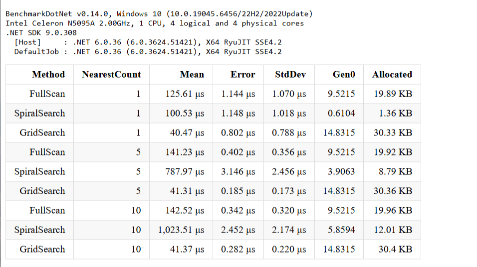

# formaxtech
задание для практики в максим технолоджи

# Поиск ближайших водителей

## Сравнение производительности алгоритмов

| Method       | NearestCount | Mean       | Allocated |
|------------- |------------- |-----------:|----------:|
| FullScan     | 1            | 125.61 µs  | 19.89 KB  |
| SpiralSearch | 1            | 100.53 µs  | 1.36 KB   |
| GridSearch   | 1            | 40.47 µs   | 30.33 KB  |
| FullScan     | 5            | 141.23 µs  | 19.92 KB  |
| SpiralSearch | 5            | 787.97 µs  | 8.79 KB   |
| GridSearch   | 5            | 41.31 µs   | 30.36 KB  |
| FullScan     | 10           | 142.52 µs  | 19.96 KB  |
| SpiralSearch | 10           | 1023.51 µs | 12.01 KB  |
| GridSearch   | 10           | 41.37 µs   | 30.4 KB   |

## Выводы

- **GridSearch** самый быстрый (около 41 µs независимо от количества водителей).
- **FullScan** стабилен по времени, но медленнее GridSearch при поиске 1 ближайшего.
- **SpiralSearch** хорошо работает при поиске 1 водителя, но сильно замедляется при увеличении количества
- (поиск по спирали обходит много пустых клеток).